# YouTube Trending Videos Analysis Project 📊

## Introduction and Objectives 🎯

This project aims to analyze YouTube trending videos data to gain insights into video popularity, viewer engagement, and other key aspects. The project utilizes the dataset available on [Kaggle](https://www.kaggle.com/datasets/datasnaek/youtube-new) containing information about various attributes of YouTube videos.

For this project, we will exclusively focus on the dataset pertaining to YouTube trending videos in the United States.

## Team Members 👥

1. Rayan Aloufi: Choosing the dataset and building the charts and WordCloud.
2. Khalid Alhumaidan: EDA and Data cleaning.
3. Hussam Al-Zhranai: Building the charts and making Pandas Profiling report and README.md file.

## Dataset Overview and Source 📈

The dataset used in this project is sourced from [Kaggle](https://www.kaggle.com/datasets/datasnaek/youtube-new). It includes information about video details, such as video ID, trending date, title, channel, category, views, likes, dislikes, comment count, and more.

## Data Preparation and Cleaning 🧹

The following steps were taken to prepare and clean the dataset for analysis:

- Unnecessary columns were dropped.
- Categories were obtained from the JSON dataset.
- Data was merged with category information.
- Rows with 0 likes and 0 dislikes were removed.
- Dates were formatted and transformed as needed.
- Data was normalized using Min-Max scaling.
- A sample subset of the data was created for further analysis.

## Charts and Insights 📊

The analysis includes various charts to visualize trends and relationships within the data:

### 1. Average Views per Category 📈
   
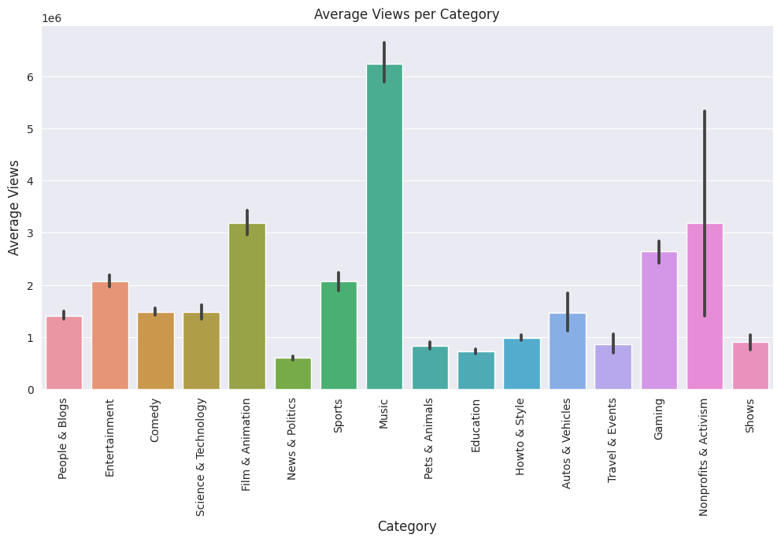

### Some insights from (Average views per category):
- Music is the highest viewed category in Youtube.
- Lowest viewed category is News & Politics.
- Education videos are well distributed in terms of views.
- Nonprofits & Activisim videos have bad distribution, and maybe contains outliers.
---

### 2. Days it took for a video to be trending 📊

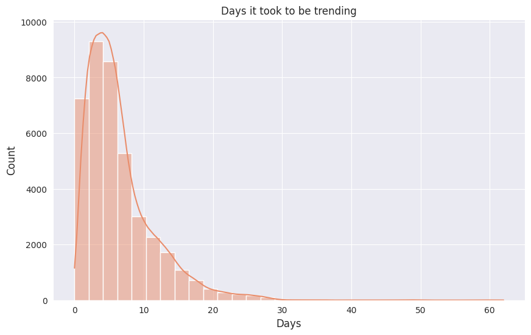

### Some insights from (Days it took to be trending):
- It is left distributed.
- it means that most videos take from 1 to 10 days to be trending.
- There are videos that took 40 days and more to be trending.
---

### 3. Likes vs. Dislikes Scatter Plot 📈

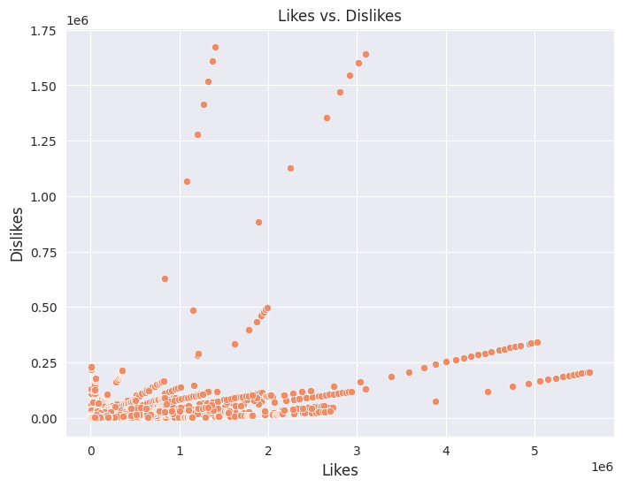

### Some insights from (Likes vs Dislikes):
- Likes and Dislikes are not that correlated.
- Some videos contain very high number of dislikes, and low likes, maybe they are offensive?
---

### 4. Number of Videos per Category 📊

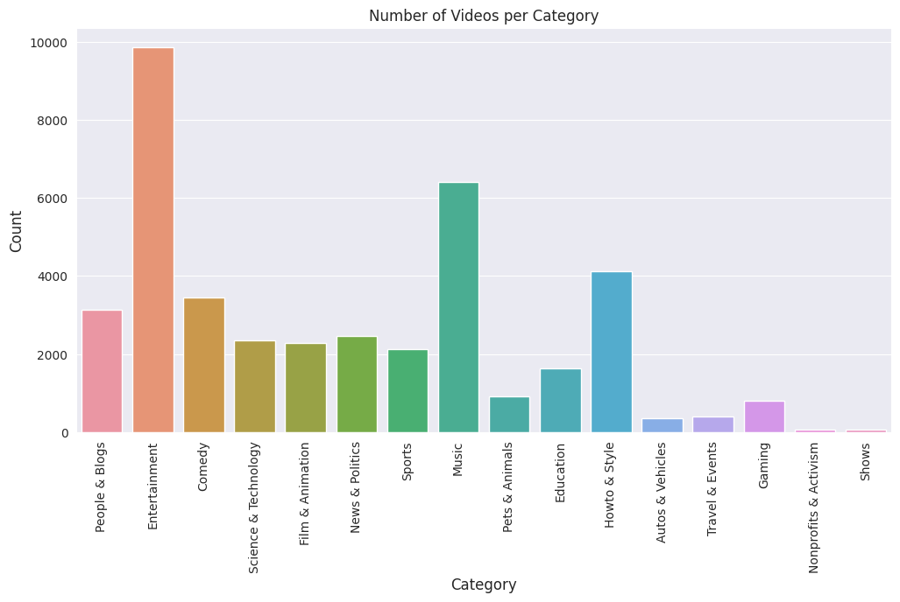

### Some insights from (Number of videos per category):
- Entertainment has the highest number of videos.
- Shows and Nonprofit & Activisim has the lowest.
- Music is not the highest count but it has the highest average views, it is understandable since people listen to music repeatedly.
---

### 5. Pair Plot of Numerical Columns 📊

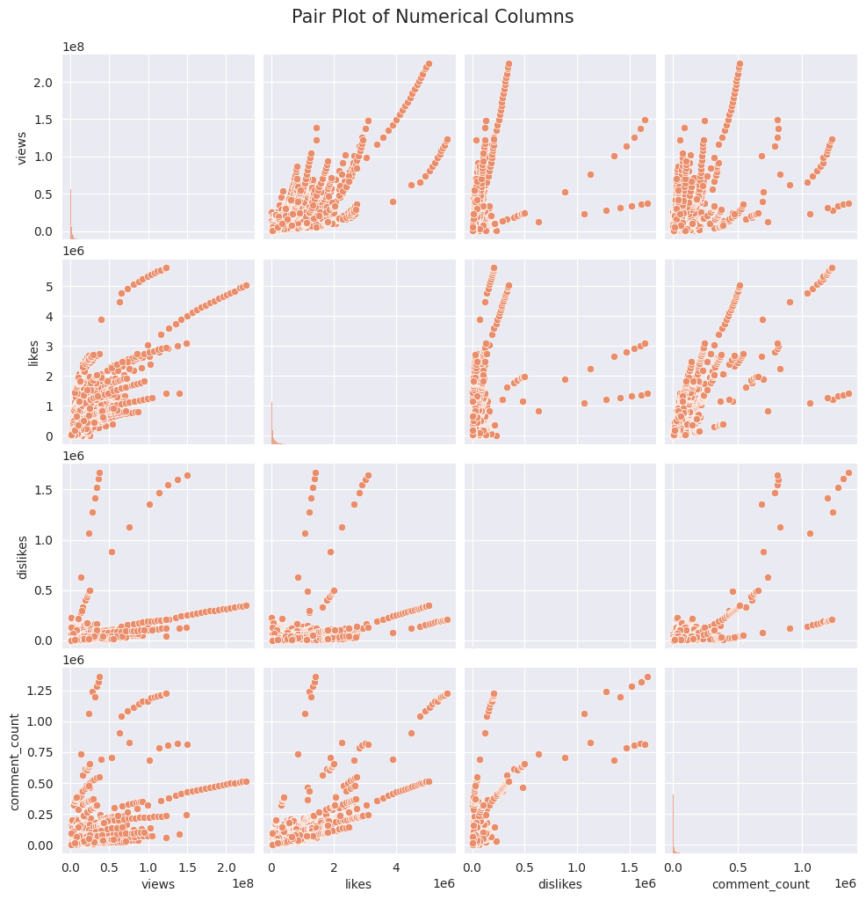

### Some insights from (Pair plot):
- Views are correlated with likes, dislikes, comment count.
- All of them are left distributed.
- There are huge number of outlires, and non-normal values.
---

### 6. Average Likes for Videos with and without Disabled Comments 📊

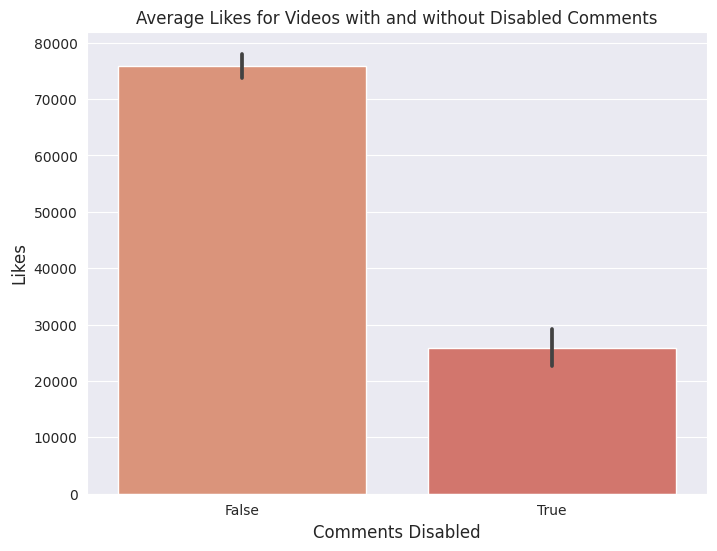

### 7. Average Dislikes for Videos with and without Disabled Comments 📊

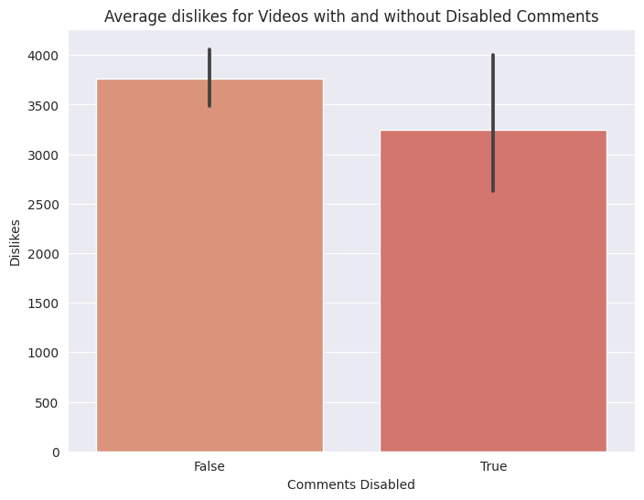

### Some insights from (Average likes and dislikes with comments disabled, 6 and 7):
- When the comments are disabled average percentage of dislikes are usually higher than likes.
- The average distribution is the same on True or False.
---

### 8. Distribution of Videos by Category (Pie Chart) 📊

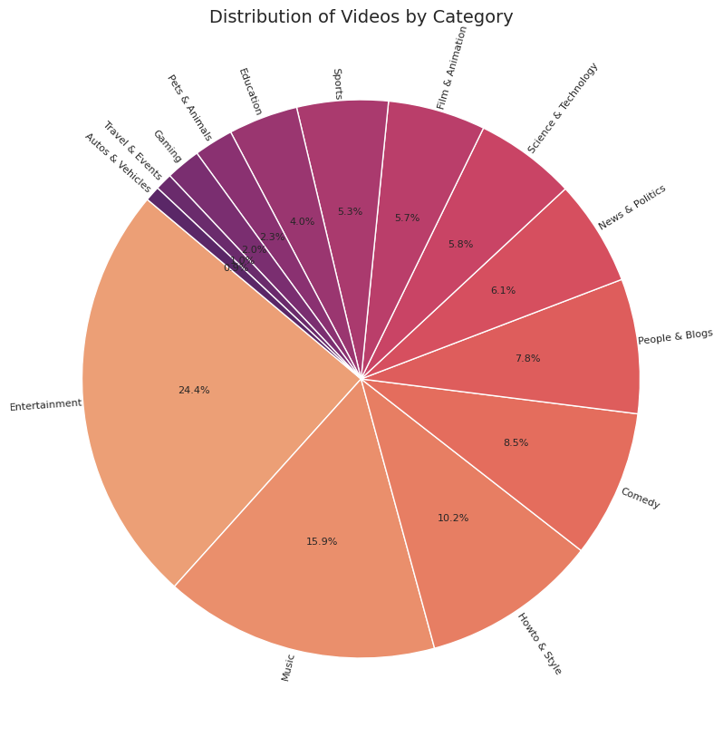

### Some insights from (disribution of videos per category):
- Entertainment has 24.4% of the total videos in the data set.
- Autos & Vehicles has 0.9%
---

### 9. Correlation Matrix (Heatmap) 📊

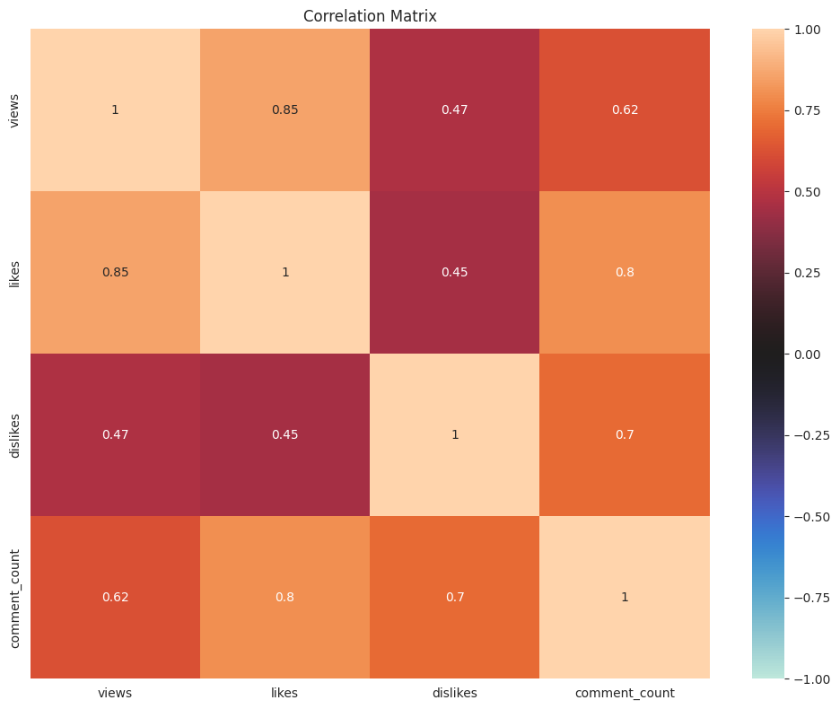

### Some insights from (Correlation Heatmap):
- Like is highly correlated with views and comment count.
- Dislikes are not really correlated with views and likes, but, it is correlated with comment count.
- This is normal, since the video has high number of comments people will be divided into haters or supporters.
---

### 10. Trends in Views over Time (Line Chart) 📈

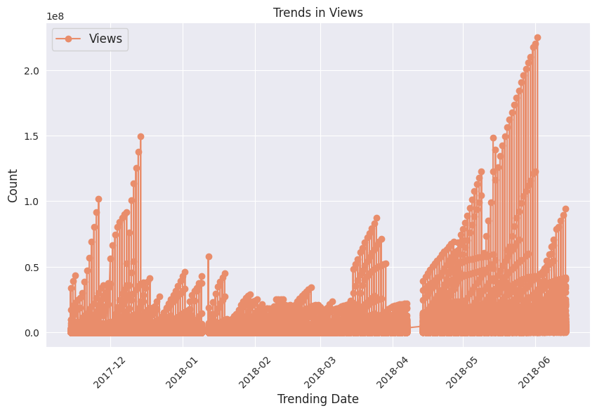

### Some insights from (the average views for each trending date):
- In 2018-05 there is a spike in the views count.
- In 2018-01 and 2018-02 the views count is down.
---

### 11. Trends in Likes and Dislikes over Time (Line Chart) 📈

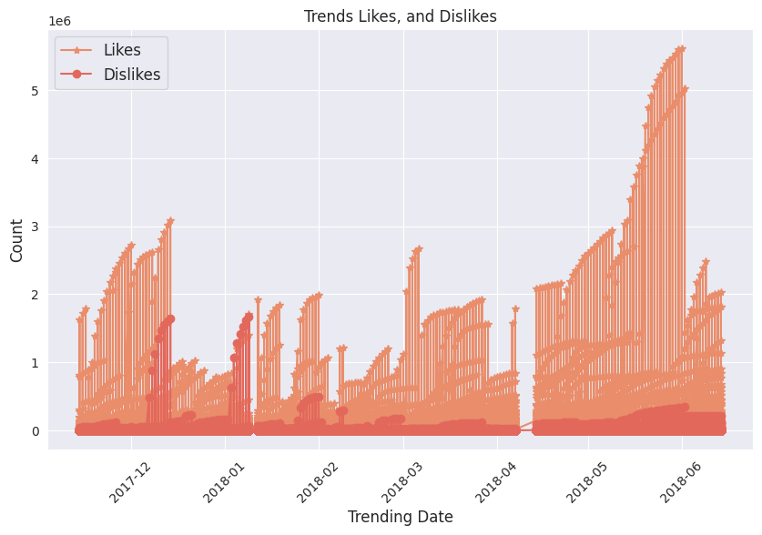

### Some insights from (the average likes and dislikes for each trending date):
- In 2018-05 there is a spike in likes and dislikes count.
- In 2018-02 both the likes and dislikes count is down.
---

## WordCloud of Video Titles (Extra) 💬

A WordCloud was generated from the unique video titles to visualize the most common words used in video titles.

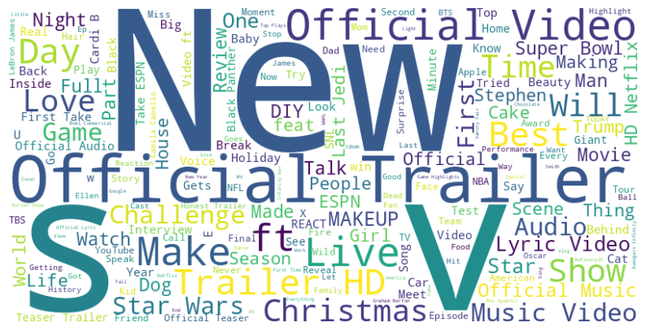

## Subplot of all the charts

## Pandas Profiling 📋

Additionally, a [Pandas Profiling](Dataset-Pandas-Summary.html) report was generated to provide a comprehensive overview of the dataset.

For detailed code and explanations, please refer to the Python code provided in this repository.
