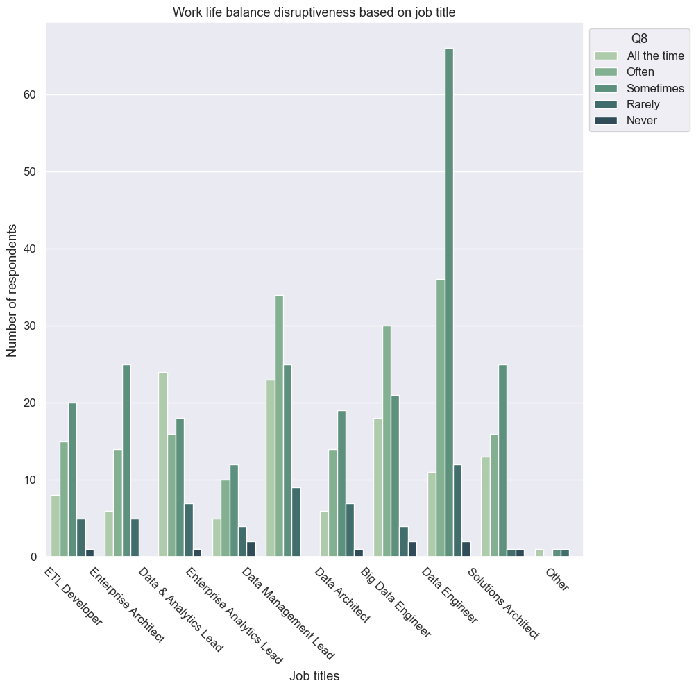
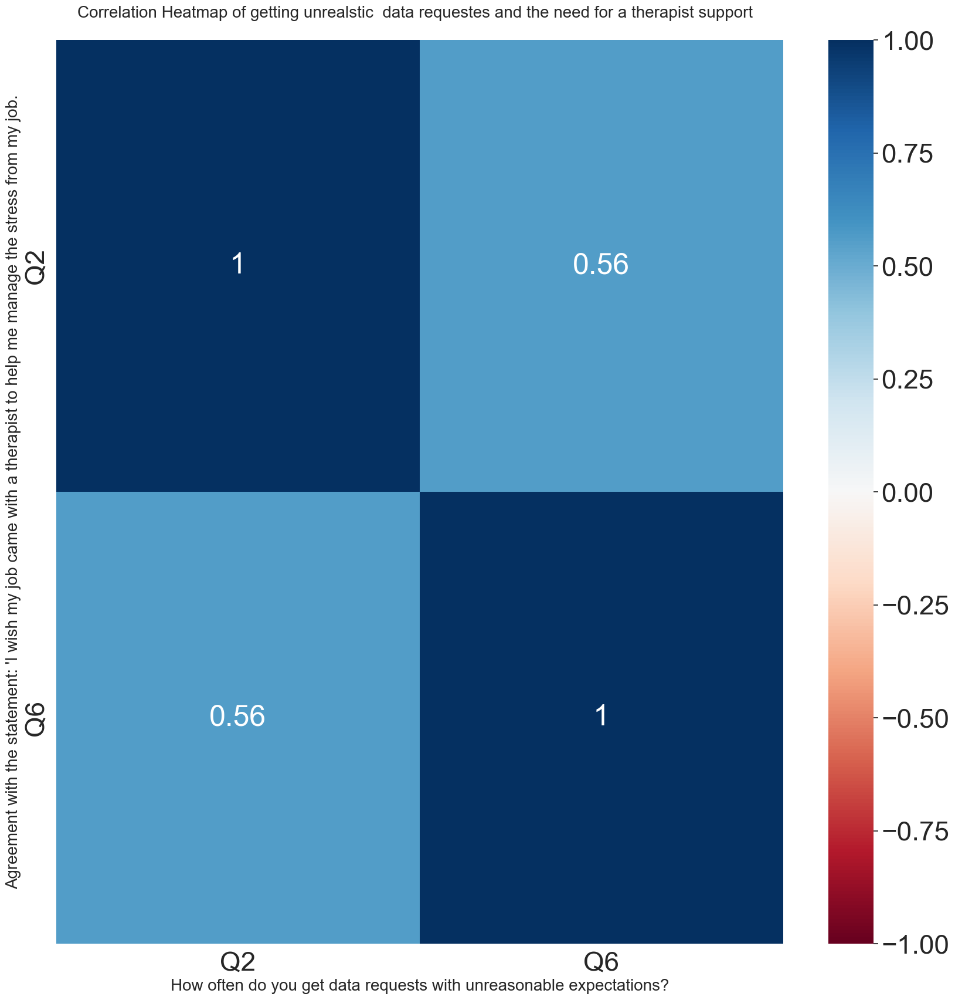

## Team Members
| Rayan | Hussain | Abdulrahman
|--------|-------|-------|
| writing readme file | source code management| Looking for a dataset based on project requirements
| Data cleaning | Data cleaning | Data cleaning
extracting insights based on EDA | extracting insights based on EDA | extracting insights based on EDA 
# introduction

We Found an interseting to us sense we are in DS bootcamp, it an online survey of 600 Data Engineers or related titles, 100 of which were Manager-Level Employees, so we desided to analyze this survay it might conatain some intersting informaiton.

### **Problems**
- Colums title hard to understand, we had another sheet to discribe the colums.
- Integers values are 5% of all values.
- Values contain a lot of symbols.
- Same Answers for a Question found in different columns, due to multiple choice questions.

### **Objectives**
- Removing all symbols from symbols.
- Using loops for multiple choice questions and turn them to boolean columns.
- Changing question that have a rate to integer so we can find a correlations.
- using the right drawing to visualize the data.

# **Datase Overview**
#### **Data Summary**
Results of any sample are subject to sampling variation. The magnitude of the variation is measurable and is affected by the number of interviews and the level of the percentages expressing the results. For the interviews conducted in this particular study, the chances are <mark>95 in 100</mark> that a survey result does not vary, plus or minus, by more than <mark>4.0 percentage</mark> points from the result that would be obtained if interviews had been conducted with all persons in the universe represented by the sample.

#### **Data Source**
Data.Word website:
https://data.world/industryresearch/data-engineer-survey-2021

# Insights

### 1) 
### Most participants who are getting data requests that are not reasonable have a high need for a therapist support as this can affect their work-life balance.

### 2)
### Data & analytics lead mostly face work life balance issues compared to data engineers where a decent portion of participants only face rarely to never work life balance issues.

### 3)
### For companies with revenue more than 500 million there is usually an imbalance between work and life
### Most work life disrubtness occures in companies with revenue between 25 million and 500 million.

### 4) 
### The graph demonstrates that individuals who have implemented DataOps, either partially or fully, are effectively engaging in communication and collaboration with various teams throughout the data model creation and management process.

### 5)
### Companies that are applying the pratices of DataOps are having a high revenue comapring it with comapanies that are not applying it.

### 6)
### The more the importance of DataOps the more employees face difficulties on their day-to-day job.

### 7) 
### The majority of the participants agree that using cutting edge tools for managing data and building analytics are ineffective without processes that deploy, monitor and manage analytics throughout the lifecycle.

### 8)
### For companies with revenue less than 25 million, the average employee has around 3-5 years of experience.
###  For companies starting from 25 million revenue per year, the average employee has more that 10 years of experience.

### 9)
### most management level employees have 0-15 years of experience in the field of data engineering   
### years of expereience have little to no effect on reaching management level 

### 10)
### Graduated or post-graduated people often get request that are not possible to do in the time requested and not possible given the desired function and features requested.

### 11)
### from 3 states most of the revenue is between 100 to 500 million$.

### 12)
### Ages in the industry are most between 35-55.
### Male are more than women.

### 13)
### Correlation Heatmap of getting unrealstic  data requestes and the need for a therapist support>
